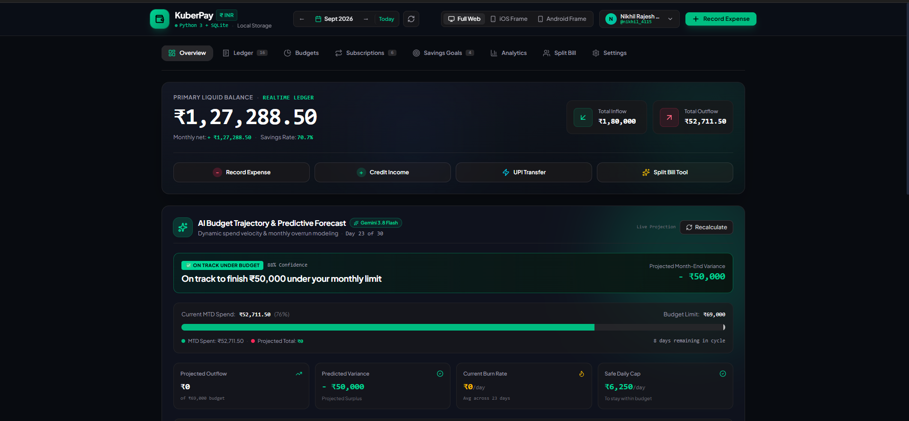
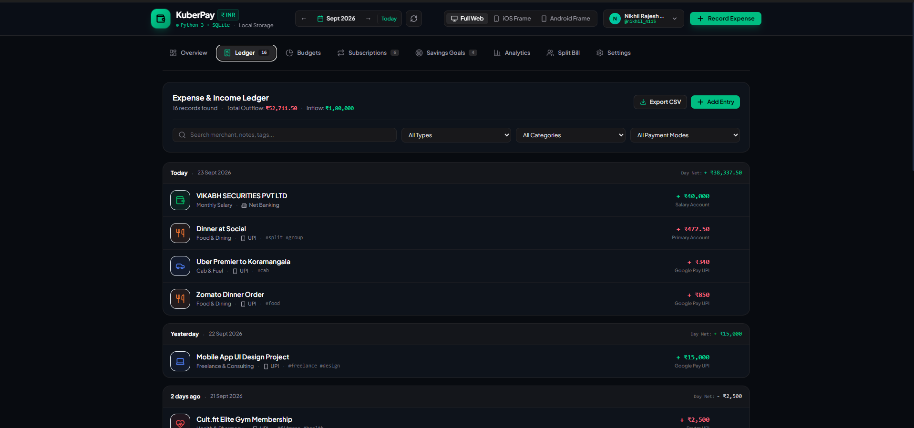
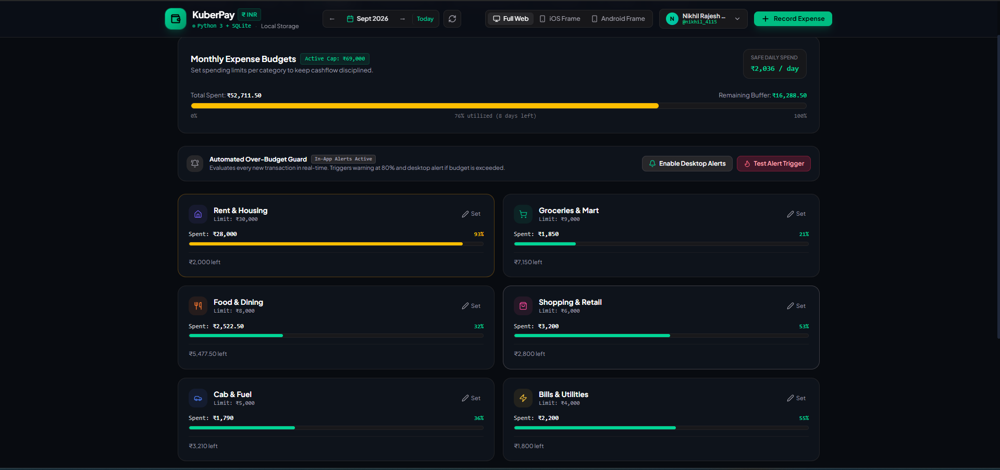
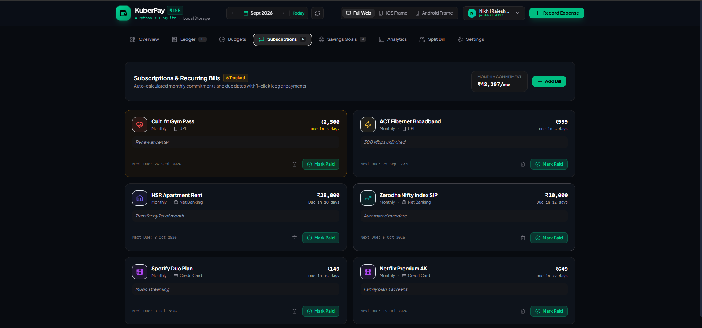
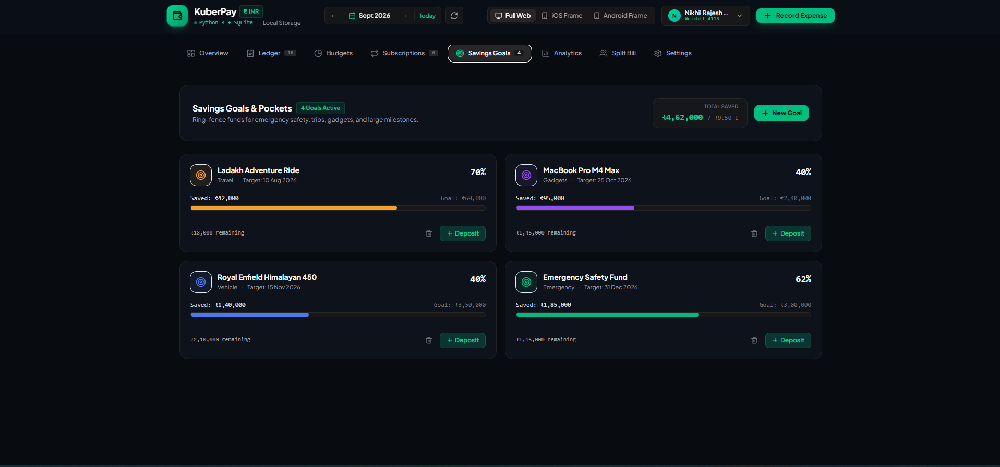
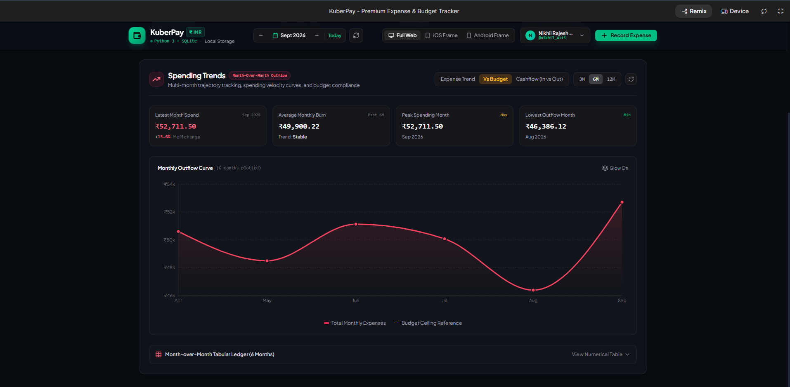
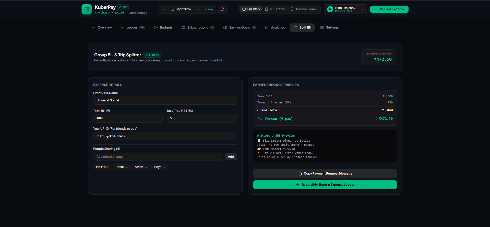
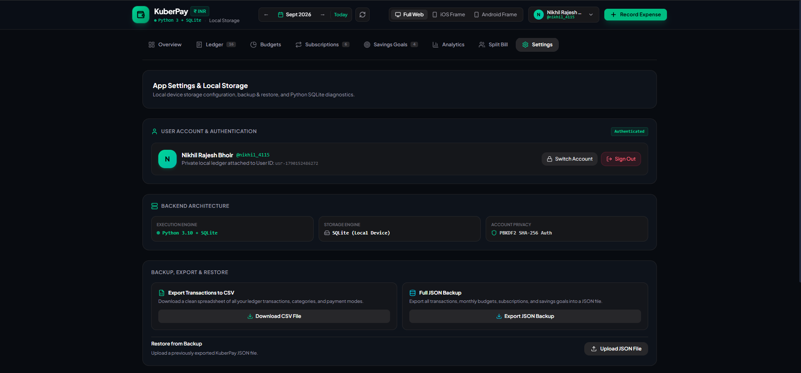
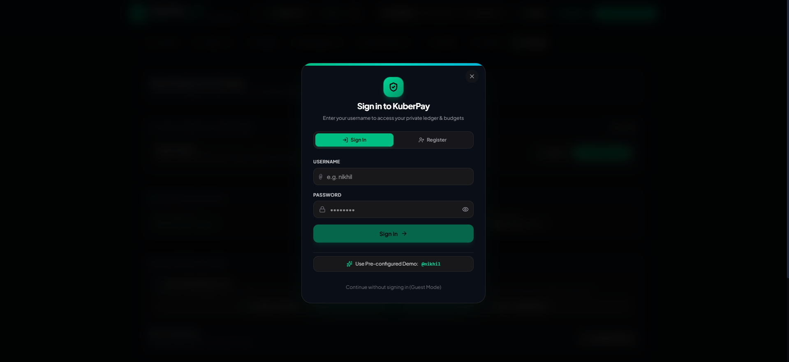

<div align="center">

# 💰 KuberPay — Premium Expense & Budget Tracker

**A dark, premium personal finance tracker for INR (₹) — expenses, category budgets, recurring bills, savings goals, bill-splitting, and AI-powered receipt scanning, all backed by a self-contained Python + SQLite server.**


</div>

---

## Table of Contents

- [Overview](#overview)
- [Screenshots](#-screenshots)
- [Features](#-features)
  - [Overview Dashboard](#1-overview-dashboard)
  - [Ledger](#2-ledger)
  - [AI Receipt Scanner](#3-ai-receipt-scanner)
  - [Budgets & Over-Budget Alerts](#4-budgets--over-budget-alerts)
  - [Subscriptions & Recurring Bills](#5-subscriptions--recurring-bills)
  - [Savings Goals](#6-savings-goals)
  - [Analytics & Spending Trends](#7-analytics--spending-trends)
  - [Bill Splitter](#8-bill-splitter)
  - [Authentication & Multi-User Support](#9-authentication--multi-user-support)
  - [Settings, Backup & Restore](#10-settings-backup--restore)
- [Tech Stack](#-tech-stack)
- [Architecture](#-architecture)
- [Project Structure](#-project-structure)
- [Data Model](#-data-model)
- [Getting Started](#-getting-started)
- [Environment Variables](#-environment-variables)
- [API Reference](#-api-reference)
- [Smart-Scan Text Parser](#-smart-scan-text-parser)
- [Responsive Preview Frames](#-responsive-preview-frames)
- [Data & Privacy](#-data--privacy)
- [Roadmap Ideas](#-roadmap-ideas)
- [Troubleshooting](#-troubleshooting)
- [Contributing](#-contributing)
- [License](#-license)

---

## Overview

KuberPay is a self-hosted, **local-first** personal finance tracker built specifically around Indian spending habits — UPI, SIPs, rent via NEFT, Swiggy/Zomato/Blinkit, Cult.fit, and INR-native formatting (Lakhs & Crores).

It is intentionally split into two independent, easy-to-run pieces:

- A **frontend** built with React, TypeScript, Vite, and Tailwind CSS that renders a dark, premium finance dashboard UI.
- A **backend** written in **pure Python 3** (no Flask/Django/FastAPI — just the standard library's `http.server`) that persists everything to a local **SQLite** database file.

On top of the core ledger/budget functionality, KuberPay integrates **Gemini 3.8 Flash** for two AI-powered features: scanning a physical paper receipt with your camera to auto-fill a transaction, and generating a live, predictive "will I go over budget this month?" forecast on the Overview dashboard.

There is no cloud backend, no external finance API, and no telemetry — your ledger lives in a SQLite file on your own machine.

---

## 📸 Screenshots

<table>
<tr>
<td width="50%">

**Overview Dashboard**
<br/>Real-time balance, quick actions, and the AI Budget Trajectory forecast


</td>
<td width="50%">

**Ledger**
<br/>Searchable, filterable transaction history grouped by day


</td>
</tr>
<tr>
<td width="50%">

**Budgets**
<br/>Per-category limits, utilization bars, and the Over-Budget Guard


</td>
<td width="50%">

**Subscriptions & Recurring Bills**
<br/>Due-date tracking with 1-click "Mark Paid"


</td>
</tr>
<tr>
<td width="50%">

**Savings Goals**
<br/>Ring-fenced pockets for travel, gadgets, vehicles & emergencies


</td>
<td width="50%">

**Analytics — Spending Trends**
<br/>Multi-month outflow curve vs. budget ceiling


</td>
</tr>
<tr>
<td width="50%">

**Bill Splitter**
<br/>Split a bill, preview the UPI payment request, share via WhatsApp/SMS


</td>
<td width="50%">

**Settings**
<br/>Account, backend diagnostics, backup/restore, currency, sample data reset


</td>
</tr>
<tr>
<td width="50%">

**Sign In**
<br/>Local username/password auth, demo account, and Guest Mode


</td>
<td width="50%"></td>
</tr>
</table>

> Place these PNGs in a `screenshots/` folder at the repo root (already provided alongside this README) so the images above render correctly on GitHub.

---

## ✨ Features

### 1. Overview Dashboard

- **Primary Liquid Balance** card showing net balance, total inflow, total outflow, monthly net, and savings rate for the selected month.
- Quick-action buttons: **Record Expense**, **Credit Income**, **UPI Transfer**, **Split Bill Tool**.
- **AI Budget Trajectory & Predictive Forecast** (powered by Gemini 3.8 Flash) — analyzes day-of-month spend velocity against your budget ceiling and returns:
  - A confidence-scored verdict (e.g. *"On track to finish ₹50,000 under your monthly limit"*, 88% confidence)
  - Projected month-end variance (surplus/overrun)
  - Current MTD spend vs. budget limit progress bar
  - Projected outflow, predicted variance, current burn rate (₹/day), and a safe daily spending cap
  - A **Recalculate** button to re-run the forecast on demand

### 2. Ledger

- Full transaction history grouped by day (**Today**, **Yesterday**, **2 days ago**, …) with a running daily net.
- Search across merchant name, notes, payment method, and tags.
- Filter by **Type** (expense/income), **Category**, and **Payment Mode** (UPI, Cash, Credit Card, Debit Card, Net Banking).
- Per-transaction category icon, color, tags (e.g. `#split`, `#group`, `#freelance`), and account label.
- **Export to CSV** directly from the ledger header.
- **Add Entry** opens the full transaction modal (manual entry, smart-text parsing, or receipt camera scan).

### 3. AI Receipt Scanner

- Launch the device camera (with front/back camera toggle) or upload a receipt photo.
- The captured image is sent to **Gemini 3.8 Flash** for multimodal OCR + structured parsing.
- Gemini extracts amount, merchant/title, likely category, and date, then hands the result back into the Add Transaction form pre-filled and tagged **"Gemini Parsed"** for a final review before saving.
- Handles camera permission errors gracefully, with a manual-entry fallback if the camera or parsing fails.

### 4. Budgets & Over-Budget Alerts

- Set a monthly ₹ limit per expense category (Rent & Housing, Groceries & Mart, Food & Dining, Shopping & Retail, Cab & Fuel, Bills & Utilities, and more).
- Each category card shows amount spent, percentage utilized, and remaining buffer, color-coded:
  - 🟢 Green — under the alert threshold
  - 🟡 Amber — at/above the alert threshold (default **80%**, configurable per category)
  - 🔴 Rose — over budget, with the exact overage shown
- A top-level **Monthly Expense Budgets** summary bar shows total spent vs. total budgeted, remaining buffer, and a **Safe Daily Spend** figure computed from remaining buffer ÷ days left in the month.
- **Automated Over-Budget Guard**: every new transaction is evaluated in real time. Crossing 80% of a category limit triggers an in-app warning toast; exceeding 100% triggers a critical alert (plus an optional native OS desktop notification, once permission is granted).
- A **Test Alert Trigger** button lets you preview the alert UI without waiting for a real transaction.

### 5. Subscriptions & Recurring Bills

- Track subscriptions and recurring payments (rent, SIPs, gym, broadband, OTT, etc.) with:
  - Amount, frequency (`daily` / `weekly` / `monthly` / `yearly`), payment method, category, and notes
  - Next due date with live "Due in N days" / "Due Today" / "Overdue (Nd)" labels
- Auto-calculated **total monthly commitment**, normalizing all frequencies to a monthly figure (weekly × 4.33, yearly ÷ 12, daily × 30).
- **Mark Paid** logs a linked transaction in the ledger and automatically rolls `next_due_date` forward by the item's frequency.
- Add new bills via a modal form; delete bills you no longer track.

### 6. Savings Goals

- Create ring-fenced savings "pockets" (Emergency Fund, a vehicle, a trip, a gadget, etc.) with a target amount, deadline, category, icon, and color.
- Each goal card shows saved amount, goal amount, percentage complete, and remaining amount, with a colored progress bar.
- **Deposit** into a goal (optionally logging a linked expense transaction so the money is reflected as "spent" toward savings); goals also support withdrawals via the API.
- A header summary shows **Total Saved** across all active goals against the combined target.

### 7. Analytics & Spending Trends

- **Financial Analytics & Insights** panel with four scorecards: Total Inflow, Total Outflow, Average Daily Burn, and Top Spend Category.
- **Spending Trends** (Recharts-powered): a multi-month outflow curve with switchable **Expense Trend / Vs Budget / Cashflow (In vs Out)** views and a **3M / 6M / 12M** range toggle, plus:
  - Latest month spend with MoM % change
  - Average monthly burn and trend direction (increasing / decreasing / stable)
  - Peak spending month and lowest outflow month
  - A collapsible month-over-month tabular ledger
- **Daily Spending Trajectory** bar chart for the selected month with hover tooltips.
- **Expense by Category** breakdown with percentage share and colored progress bars.
- **Payment Method Channels** breakdown showing spend and transaction count per payment mode (UPI, Cards, Cash, Net Banking).

### 8. Bill Splitter

- Enter a bill name, total amount, and tax/tip/GST %, and add any number of friends sharing the cost.
- Automatically computes the grand total and an even per-person share.
- Generates a ready-to-send **WhatsApp/SMS payment request message** including your UPI ID, with a **Copy to Clipboard** button.
- **Record My Share in Expense Ledger** logs your portion as a tagged (`#split #group`) expense transaction in one click.

### 9. Authentication & Multi-User Support

- Local username/password accounts, hashed with **PBKDF2-HMAC-SHA256** (100,000 iterations) plus a unique per-user salt — no plaintext passwords are ever stored.
- Session-token based auth (`Authorization: Bearer <token>` or `X-Session-Token` header), tokens valid for 30 days.
- **Register**, **Sign In**, a **1-click pre-configured demo account** (`@nikhil` / `password123`), and **Guest Mode** for using the app without an account.
- Per-user data isolation is handled at the query level (falls back to a shared `user-demo` dataset for guests/legacy rows).

### 10. Settings, Backup & Restore

- **User Account & Authentication** panel — switch accounts, register a new user, or sign out.
- **Backend Architecture** diagnostics — live execution engine, storage engine, and account privacy scheme, pulled from `/api/health`.
- **Export Transactions to CSV** and **Full JSON Backup** (transactions, budgets, recurring bills, and savings goals) for safekeeping.
- **Restore from Backup** — upload a previously exported KuberPay JSON file to overwrite current data.
- **Currency & Formatting** — INR (default, Lakhs & Crores formatting), plus USD/EUR/GBP display options.
- **Reset Sample Ledger** — wipe and reseed the database with realistic sample Indian transactions in one click.

---

## 🛠 Tech Stack

| Layer | Technology |
|---|---|
| Frontend framework | React 18 + TypeScript |
| Build tool | Vite |
| Styling | Tailwind CSS (dark theme, custom zinc/emerald palette) |
| Charts | Recharts |
| Icons | lucide-react |
| Backend | Python 3 standard library only (`http.server`, `sqlite3`, `hashlib`, `secrets`) — no web framework |
| Database | SQLite (single local file, zero external setup) |
| Auth | PBKDF2-HMAC-SHA256 password hashing + bearer session tokens |
| AI | Gemini 3.8 Flash — multimodal receipt OCR & budget-trajectory forecasting |

## 🏗 Architecture

```
┌─────────────────────────────┐        HTTP / JSON        ┌───────────────────────────────┐
│   React + TS Frontend       │ ─────────────────────────▶ │   Python http.server backend  │
│   (Vite dev server)         │ ◀───────────────────────── │   (backend/server.py)         │
│                              │                            │                                │
│  • Overview / Ledger        │                            │  • REST API (/api/...)        │
│  • Budgets / Subscriptions  │                            │  • SQLite persistence         │
│  • Savings / Analytics      │                            │  • PBKDF2 auth + sessions     │
│  • Bill Splitter / Settings │                            │  • CSV/JSON export & import    │
└──────────────┬───────────────┘                            └───────────────┬────────────────┘
               │                                                             │
               │ image / prompt                                             ▼
               ▼                                                   ┌──────────────────┐
     ┌───────────────────┐                                         │  data/expenses.db │
     │   Gemini 3.8 Flash │                                        │     (SQLite)      │
     │  (receipt OCR +    │                                        └──────────────────┘
     │  budget forecast)  │
     └───────────────────┘
```

The frontend calls Gemini's API directly from the client using the `GEMINI_API_KEY` you configure locally for development. The Python backend has no knowledge of Gemini; it is only responsible for ledger CRUD, analytics aggregation, auth, and import/export.

## 📁 Project Structure

```
├── backend/
│   └── server.py                  # Python HTTP API server + SQLite schema & seed data
├── src/
│   ├── main.tsx                    # App entry point (React root)
│   ├── App.tsx                     # Top-level layout, tab routing, state
│   ├── types.ts                    # Shared TS types (Transaction, Budget, User, ...)
│   ├── components/
│   │   ├── Header.tsx               # Top nav: month switcher, device frame toggle, auth
│   │   ├── MobileNavbar.tsx         # Bottom tab bar for mobile viewports
│   │   ├── AuthModal.tsx            # Sign in / Register modal
│   │   ├── AddTransactionModal.tsx  # Manual entry + smart-scan + receipt scan entry point
│   │   ├── ReceiptCameraScanner.tsx # Camera capture + Gemini OCR analysis
│   │   ├── OverviewTab.tsx          # Dashboard + AI budget trajectory
│   │   ├── BudgetTrajectoryCard.tsx # Gemini-powered forecast card
│   │   ├── TransactionsTab.tsx      # Ledger view
│   │   ├── BudgetsTab.tsx           # Category budget management
│   │   ├── BudgetAlertToast.tsx     # Real-time over-budget alert toasts
│   │   ├── RecurringTab.tsx         # Subscriptions & recurring bills
│   │   ├── SavingsTab.tsx           # Savings goals / pockets
│   │   ├── AnalyticsTab.tsx         # Category & payment method breakdowns
│   │   ├── SpendingTrends.tsx       # Multi-month Recharts trend view
│   │   ├── SplitterTab.tsx          # Bill splitter
│   │   └── SettingsTab.tsx          # Account, backup/restore, currency, reset
│   └── lib/
│       ├── api.ts                   # Fetch wrapper for backend + Gemini calls
│       ├── formatters.ts            # INR currency (Lakhs/Crores) & date formatting
│       ├── icons.ts                 # Category → lucide icon / payment icon mapping
│       └── budgetEvaluator.ts       # Real-time budget threshold evaluation logic
├── index.html
├── main.tsx
└── README.md
```

## 🗃 Data Model

The SQLite schema is created automatically on first run (`init_db()` in `server.py`).

**`users`**
| Column | Type | Notes |
|---|---|---|
| id | TEXT PK | e.g. `usr-1790152486272` |
| username | TEXT UNIQUE | lowercase, min 3 chars |
| password_hash / salt | TEXT | PBKDF2-HMAC-SHA256, 100k iterations |
| display_name | TEXT | |
| currency | TEXT | default `INR` |

**`sessions`** — `token` (PK), `user_id`, `created_at`, `expires_at` (30-day TTL)

**`transactions`**
| Column | Type | Notes |
|---|---|---|
| id | TEXT PK | e.g. `tx-1758…` |
| user_id | TEXT | defaults to `user-demo` |
| type | TEXT | `expense` \| `income` \| `transfer` |
| amount | REAL | |
| category_id | TEXT | FK → `categories.id` |
| title / note | TEXT | |
| date | TEXT | `YYYY-MM-DD` |
| payment_method | TEXT | `UPI` \| `Cash` \| `Credit Card` \| `Debit Card` \| `Net Banking` |
| tags | TEXT | JSON array, e.g. `["#split","#group"]` |
| receipt_url | TEXT | optional, set by the receipt scanner |
| account | TEXT | e.g. `Primary Account`, `HDFC Salary A/c` |

**`categories`** — 15 seeded categories (10 expense, 5 income), each with an `id`, display `name`, `icon` (lucide name), hex `color`, and `type`.

| id | name | type |
|---|---|---|
| food | Food & Dining | expense |
| groceries | Groceries & Mart | expense |
| shopping | Shopping & Retail | expense |
| housing | Rent & Housing | expense |
| transport | Cab & Fuel | expense |
| bills | Bills & Utilities | expense |
| entertainment | Entertainment & OTT | expense |
| health | Health & Pharmacy | expense |
| travel | Travel & Vacation | expense |
| investment | SIP & Mutual Funds | expense |
| salary | Monthly Salary | income |
| freelance | Freelance & Consulting | income |
| investment_return | Dividends & Returns | income |
| cashback | Cashback & Rewards | income |
| other_income | Other Credits | income |

**`budgets`** — `category_id` (unique), `monthly_limit`, `month` (`YYYY-MM`), `alert_threshold` (default `0.8`)

**`recurring`** — `title`, `amount`, `type`, `category_id`, `payment_method`, `frequency` (`daily`/`weekly`/`monthly`/`yearly`), `next_due_date`, `is_active`, `auto_pay`, `note`

**`savings_goals`** — `title`, `target_amount`, `current_amount`, `deadline`, `category`, `icon`, `color`

On first launch, the database is auto-seeded with a demo user (`nikhil` / `password123`), ~14 realistic sample transactions, 8 category budgets, 6 recurring bills, and 4 savings goals — all in INR with Bengaluru-flavored merchants (Blinkit, Swiggy, Zerodha, HSR Layout rent, Cult.fit, etc.).

---

## 🚀 Getting Started

### Prerequisites

- **Node.js** v18+ and npm
- **Python** 3.10+
- A [Gemini API key](https://aistudio.google.com/apikey) (required for the receipt scanner and the AI budget trajectory card — the rest of the app works without it)

### 1. Clone the repository

```bash
git clone <your-repo-url>
cd kuberpay
```

### 2. Install frontend dependencies

```bash
npm install
```

### 3. Configure environment variables

Create a `.env.local` file in the project root:

```env
GEMINI_API_KEY=your_gemini_api_key_here
```

### 4. Start the Python backend

```bash
python3 backend/server.py
```

This will:
- Create a `data/` directory (sibling to `backend/`) with an `expenses.db` SQLite file if one doesn't exist
- Run all table creation + column migrations
- Seed the demo user, sample transactions, budgets, recurring bills, and savings goals on first run
- Start listening on `http://127.0.0.1:5005`

```
[*] Python KuberPay backend listening on http://127.0.0.1:5005
```

### 5. Start the frontend dev server

In a second terminal:

```bash
npm run dev
```

Open the printed local URL. From the sign-in screen you can:
- Click **Use Pre-configured Demo** (`@nikhil` / `password123`) to explore with realistic sample data, or
- Click **Continue without signing in (Guest Mode)**, or
- **Register** a brand-new account.

### 6. (Optional) Build for production

```bash
npm run build
```

Serve the resulting static build with any static file server, keeping the Python backend running alongside it (reachable at the same origin/port your frontend `lib/api.ts` is configured to call).

## 🔑 Environment Variables

| Variable | Used by | Description |
|---|---|---|
| `GEMINI_API_KEY` | Frontend (`.env.local`) | Required for receipt scanning OCR and the AI budget trajectory forecast |
| `PYTHON_PORT` | Backend (`backend/server.py`) | Override the default backend port (`5005`) |

---

## 🔌 API Reference

Base URL (default): `http://127.0.0.1:5005`

All write endpoints accept/return JSON. Authenticated endpoints read the session token from either `Authorization: Bearer <token>` or `X-Session-Token`; unauthenticated requests fall back to the shared `user-demo` dataset.

### Health & Auth

| Method | Endpoint | Body | Description |
|---|---|---|---|
| GET | `/api/health` | — | Returns backend name, DB path, and UTC timestamp |
| GET | `/api/auth/me` | — | `{ authenticated, user }` for the current session token |
| POST | `/api/auth/register` | `{ username, password, display_name? }` | Creates a user (username ≥ 3 chars, password ≥ 4 chars), returns a session token |
| POST | `/api/auth/login` | `{ username, password }` | Verifies credentials, returns a session token |
| POST | `/api/auth/logout` | — | Deletes the current session token |

**Example — register:**
```json
POST /api/auth/register
{ "username": "priya", "password": "s3cret!", "display_name": "Priya Sharma" }
```
```json
201
{
  "status": "ok",
  "token": "a1b2c3...",
  "user": { "id": "usr-...", "username": "priya", "display_name": "Priya Sharma", "currency": "INR", "created_at": "..." }
}
```

### Categories

| Method | Endpoint | Description |
|---|---|---|
| GET | `/api/categories` | All categories, sorted alphabetically |

### Transactions

| Method | Endpoint | Query params | Description |
|---|---|---|---|
| GET | `/api/transactions` | `search`, `type`, `category_id`, `payment_method`, `start_date`, `end_date`, `sort` (`date_desc` default, `date_asc`, `amount_desc`, `amount_asc`), `limit` (default 200) | Filtered, sorted transaction list joined with category info |
| POST | `/api/transactions` | — | Creates a transaction; body: `{ type, amount, category_id, title, note, date, payment_method, tags[], account }` |
| PUT | `/api/transactions/{id}` | — | Full update of a transaction |
| DELETE | `/api/transactions/{id}` | — | Deletes a transaction |

### Budgets

| Method | Endpoint | Description |
|---|---|---|
| GET | `/api/budgets?month=YYYY-MM` | All expense categories joined with their budget (if set) and actual `spent`/`remaining`/`percentage` for the month |
| POST | `/api/budgets` | Upsert (insert or update) a category's `monthly_limit`, `month`, and `alert_threshold` |

### Recurring Bills

| Method | Endpoint | Description |
|---|---|---|
| GET | `/api/recurring` | All recurring items, joined with category info, sorted by next due date |
| POST | `/api/recurring` | Create a new recurring bill |
| PUT | `/api/recurring/{id}` | Update a recurring bill |
| DELETE | `/api/recurring/{id}` | Delete a recurring bill |
| POST | `/api/recurring/{id}/pay` | Logs a transaction for the bill and advances `next_due_date` by its frequency (monthly ≈ +30d, weekly +7d, yearly +365d, daily +1d) |

### Savings Goals

| Method | Endpoint | Description |
|---|---|---|
| GET | `/api/goals` | All goals with a computed `progress_percentage` |
| POST | `/api/goals` | Create a new goal |
| PUT | `/api/goals/{id}` | Update a goal |
| DELETE | `/api/goals/{id}` | Delete a goal |
| POST | `/api/goals/{id}/deposit` | Add funds; optionally logs a linked expense transaction (`create_transaction: true` by default) |
| POST | `/api/goals/{id}/withdraw` | Remove funds; optionally logs a linked income transaction |

### Analytics

| Method | Endpoint | Description |
|---|---|---|
| GET | `/api/analytics?month=YYYY-MM` | Total income/expense, net savings, savings rate, category breakdown, payment-method breakdown, daily trend, and all-time balance |
| GET | `/api/analytics/spending-trends?months=6` | Month-over-month expense/income/net/savings-rate series (3–24 months), highest/lowest month, overall trend direction (`increasing`/`decreasing`/`stable`), latest MoM % |

### Export / Import

| Method | Endpoint | Description |
|---|---|---|
| GET | `/api/export/csv` | Downloads all transactions as `kuberpay_transactions_YYYYMMDD.csv` |
| GET | `/api/export/json` | Full JSON backup: `{ version, app, exported_at, currency, data: { transactions, categories, budgets, recurring, savings_goals } }` |
| POST | `/api/import/json` | Restores from a previously exported backup (replaces matching tables) |
| POST | `/api/reset-sample-data` | Wipes transactions/budgets/recurring/goals and reseeds realistic sample INR data |

### Smart Scan

| Method | Endpoint | Description |
|---|---|---|
| POST | `/api/smart-scan` | `{ text }` → parses free text into a structured transaction (see below) |

---

## 🧠 Smart-Scan Text Parser

The `/api/smart-scan` endpoint (used by the Add Transaction modal's quick-entry field) is a lightweight, dependency-free regex/keyword parser built for how Indians naturally describe payments:

**Input:**
```
"Paid 450 to Swiggy via GPay"
```

**Output:**
```json
{
  "title": "Paid 450 to Swiggy via GPay",
  "amount": 450.0,
  "type": "expense",
  "category_id": "food",
  "payment_method": "UPI",
  "date": "2026-09-23",
  "note": "Parsed from: 'Paid 450 to Swiggy via GPay'"
}
```

It detects:
- **Type** — `income` if the text mentions "received", "credited", "salary", "refund", "cashback", "deposited"; otherwise `expense`
- **Amount** — via `₹`/`Rs`/`INR` prefixed numbers, "paid/spent/sent/got/received <amount>" patterns, or a fallback to the first number found
- **Payment method** — GPay/PhonePe/Paytm/UPI/QR → `UPI`; cash/ATM → `Cash`; credit card/CC/Visa/Mastercard → `Credit Card`; debit card/DC → `Debit Card`; NEFT/RTGS/IMPS/net banking → `Net Banking`
- **Category** — keyword-matched against 10 expense categories (Swiggy/Zomato → Food, Blinkit/Zepto/DMart → Groceries, Amazon/Myntra → Shopping, Uber/Ola/fuel → Transport, rent/PG → Housing, BESCOM/broadband/recharge → Bills, Netflix/Spotify/PVR → Entertainment, Cult.fit/Apollo/pharmacy → Health, Zerodha/SIP/mutual fund → Investment, salary/payout → Salary)

---

## 📱 Responsive Preview Frames

The header includes a device-frame switcher so you can preview the layout without resizing your browser:

- **Full Web** — full-width responsive desktop layout
- **iOS Frame** — iPhone-style mobile preview
- **Android Frame** — Pixel-style mobile preview

On actual mobile viewports, the app automatically switches to the bottom `MobileNavbar` (Home / Ledger / quick-add / Budgets / Stats) instead of the top tab bar.

---

## 🔒 Data & Privacy

- All ledger data is stored **locally** in a single SQLite file (`data/expenses.db`) — nothing is synced to any cloud service.
- The only external network call the app makes is to the **Gemini API**, and only for the two explicit AI features (receipt image parsing and the budget forecast text generation).
- Passwords are never stored in plaintext — only a PBKDF2-HMAC-SHA256 hash (100,000 iterations) with a unique per-user salt, verified with a constant-time comparison (`secrets.compare_digest`).
- Session tokens are opaque 64-character hex strings (`secrets.token_hex(32)`) with a 30-day expiry.

## 🗺 Roadmap Ideas

- [ ] Per-transaction receipt image storage/gallery view
- [ ] Multi-currency ledgers (not just display formatting)
- [ ] Push/email notifications for upcoming recurring bills
- [ ] Shared "household" ledgers with multiple linked users
- [ ] Native mobile wrapper (Capacitor/React Native) around the same API

## 🧯 Troubleshooting

| Symptom | Likely cause / fix |
|---|---|
| Frontend can't reach the API | Confirm `backend/server.py` is running and listening on the port your frontend expects (`http://127.0.0.1:5005` by default, or your `PYTHON_PORT` override) |
| Receipt scanner / AI forecast fails | Check that `GEMINI_API_KEY` is set in `.env.local` and the dev server was restarted after adding it |
| "Username is already registered" on a fresh DB | Delete `data/expenses.db` to fully reset, or use `/api/reset-sample-data` / the Settings → Reset Sample Ledger button |
| CORS errors in the browser console | The backend already sends permissive `Access-Control-Allow-Origin: *` headers on every response — check you're calling the correct port |
| Camera won't start on the receipt scanner | Browser camera permissions must be granted; HTTPS or `localhost` is required by most browsers for `getUserMedia` |

## 🤝 Contributing

Issues and pull requests are welcome. Please keep new backend endpoints framework-free (pure `http.server` + `sqlite3`) to match the project's zero-dependency philosophy, and keep new UI consistent with the existing dark **zinc/emerald** design language and `lucide-react` icon set.

## 📄 License

This project is provided as-is for personal and educational use. Add your preferred license (MIT, Apache-2.0, etc.) here before publishing publicly.
